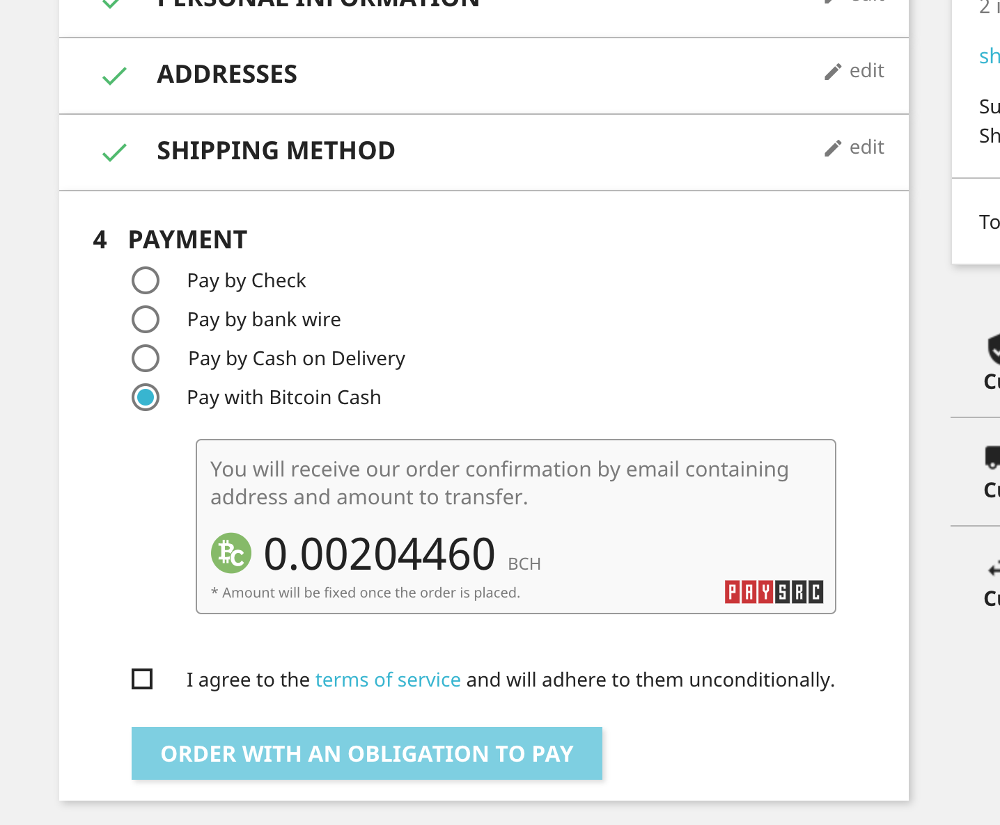
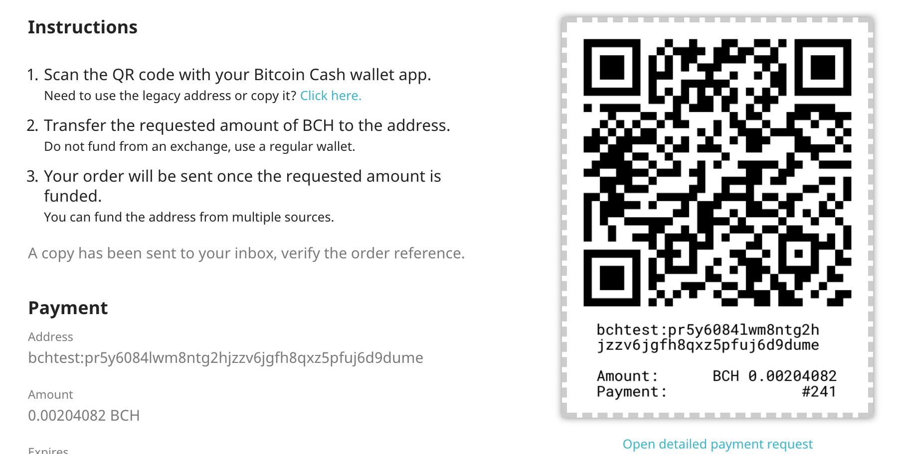

# PaySrc Module for PrestaShop

## Features

- Accept Bitcoin Cash Payments without conversions to Bitcoin Legacy nor fiat currencies.
- Request Bitcoin Cash, keep Bitcoin Cash.
- Low fee of 1%, minimum fee of 547 satoshis.
- Mixing included by default.
- Get email notifications when payment is complete.

## Requirements

- Prestashop 1.7+
- PHP 7+
- Network access to [https://api.paysrc.com/](https://api.paysrc.com/)

## Installation

1. Download *paysrc.zip* from [releases](https://github.com/paysrc/paysrc-prestashop-module/releases)
2. Upload to your PrestaShop installation, go to *```Modules```* → *```Upload a module```*
3. Create your PaySrc account at [https://paysrc.com/dashboard/register](https://paysrc.com/dashboard/register)
4. Click on your name to access your account, select *```Applications```* and create a *```New Application```*.
5. Click on *```Get Token```* on your created application and copy the token.
6. In PrestaShop, paste your token on PaySrc's configuration page.
7. Save, if the token validates, your account information will be displayed.

## Support

For support, contact us at [https://paysrc.com/en/support](https://paysrc.com/en/support).

## Troubleshoot

### I wrote my wallet address and it now displays different

The application works by default with the new cashaddr format. If you supplied an address with the old format, the system will convert it to the new cashaddr format (bitcoincash:...).

### Why is the payment address in the QR/Instructions different than the one in my account?

We create an intermediate address for the payer to send the funds to. Once the funds are confirmed in this address, the funds are then sent to your address.

### What happens if my customer accidentally sends more than the amount?

The overpaid amount is returned to the source address and network fees are shared.

## Screenshots

Checkout payment option



Order confirmation instructions


